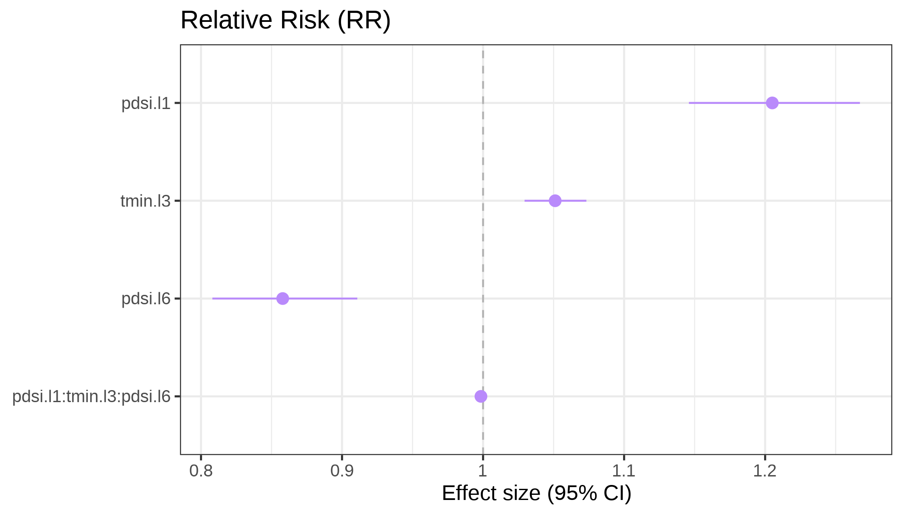

# GHRmodel   <span> <span>  

<!-- badges: start -->
[](https://www.gnu.org/licenses/old-licenses/gpl-2.0.html)
[](https://cran.r-project.org/package=GHRmodel)
[](https://cran.r-project.org/package=GHRmodel)
[](https://cran.r-project.org/package=GHRmodel)
<!-- badges: end -->


## Overview

The **GHRmodel** package supports modeling health outcomes using Bayesian hierarchical
spatio-temporal models with complex covariate effects (e.g., linear, non-linear,
interactions, distributed lag linear and non-linear models) in the
[R-INLA](https://www.r-inla.org/home) framework.
It is designed to help users identify key drivers and predictors of disease risk
by enabling streamlined model exploration, comparison, and visualization of
complex covariate effects. 

The image below shows the structure of the **GHRmodel** package, outlining its functions (in blue), 
GHRmodel-specific output objects (in purple), generic output objects (in grey),
and general functionality. Generic output objects can be provided directly by 
the user or can be generated using **GHRmodel** helper functions.


The **GHRmodel** package is designed to work in tandem with other packages of the
GHRtools suite: **GHRexplore**, which facilitates data exploration and visualization, and 
**GHRpredict**, which computes out-of-sample probabilistic predictions of models developed in
**GHRmodel** and enables predictive performance evaluation. 

More information about the toolkit, with tutorials and published examples can be
found at this [website](https://bsc-es.github.io/GHRtools/). 

<br>

## Installation 

The latest version of the **GHRmodel** package is hosted on 
[CRAN](https://cran.r-project.org/) and can by installed using the following commands:

```R
# Install from CRAN
install.packages("GHRmodel") 

# Get the development version from Gitlab
library(devtools)
devtools::install_git('https://earth.bsc.es/gitlab/ghr/ghrmodel.git')
```

**GHRmodel** depends on the **INLA** package, which is not available on CRAN. 
Instead, it must be installed from its own repository as follows:

``` r
 install.packages("INLA",repos=c(getOption("repos"),
                  INLA="https://inla.r-inla-download.org/R/stable"), dep=TRUE) 
```

In case you run into any issues, please check the installation
instructions on the [R-INLA website](https://www.r-inla.org/download-install).


## Usage

To fit a model with R-INLA, formulas need to follow its required syntax and 
structural conventions. INLA-compatible model formulas can be developed using either:

* User-defined INLA-compatible input, which may consist of either user-defined 
covariate lists or user-defined formula lists. 

* **GHRmodel** helper functions that allow the user to pre-process and transform covariates
and streamline writing INLA-compatible formulas.

In this example the user provides a list of INLA-compatible model formulas. 
These are passed to the `as_GHRformulas()` function to be converted into a 
standardized `GHRformulas` object. This ensures consistent output structure and 
random effect specification across models that can be interpreted by the function
`fit_models()` for model fitting.

```R
library("GHRmodel")

# Convert list of user-defined INLA formulas into a GHRformulas object 
formulas_user_ghr <- as_GHRformulas(c(
  
  # Model 1: random effects only, where monthly random effect is replicated by meso region and the spatial random effect is replicated by year
    "dengue_cases ~ 1 +
     f(month_id, model = 'rw1', replicate = spat_meso_id, cyclic = TRUE, constr = TRUE, hyper = prior_t) +
     f(year_id, model = 'iid', constr = TRUE, hyper = prior_t) +
     f(spat_id, model = 'bym2', graph = g, constr = TRUE, hyper = prior_sp, replicate = year_id2)",
    
  # Model 2: random effects and a varying effect for pdsi lag 1 by climate zone
  "dengue_cases ~ 1 + f(main_climate_f, pdsi.l1, model = 'iid') +
     f(month_id, model = 'rw1', replicate = spat_meso_id, cyclic = TRUE, constr = TRUE, hyper = prior_t) +
     f(year_id, model = 'iid', constr = TRUE, hyper = prior_t) +
     f(spat_id, model = 'bym2', graph = g, constr = TRUE, hyper = prior_sp, replicate = year_id2)",

  # Model 3: random effects and a 3-way interaction between different pdsi and tmin lags
  "dengue_cases ~ 1 + pdsi.l1 + tmin.l3 + pdsi.l6 + pdsi.l1:tmin.l3:pdsi.l6 +
     f(month_id, model = 'rw1', replicate = spat_meso_id, cyclic = TRUE, constr = TRUE, hyper = prior_t) +
     f(year_id, model = 'iid', constr = TRUE, hyper = prior_t) +
     f(spat_id, model = 'bym2', graph = g, constr = TRUE, hyper = prior_sp, replicate = year_id2)"
))

```

The `fit_models()` function allows users to fit a set of INLA-compatible model 
formulas defined by a `GHRformulas` object to a provided data set. 
It automates model fitting, extraction of outputs, and computation of a wide range
of goodness-of-fit (GoF) metrics. The output is a `GHRmodels` object. 

```R
# User-defined INLA-compatible formulas can be passed into fit_models() as a GHRformulas object
model_user <- fit_models(
  formulas = formulas_user_ghr,
  data = data,
  family = "nbinomial",           # Negative binomial likelihood
  name = "mod",                   # Label prefix for each model
  offset = "population",          # Offset variable to account for population size
  control_compute = list(
    config = FALSE,               # Do not posterior predictive distribution
    vcov = FALSE                  # Do not return variance-covariance matrix
  ),
  pb = TRUE,                      # Display progress bar
  nthreads = 8                    # Use 8 threads for parallel computation
)
```

For model evaluation, **GHRmodel** provides a range of functions for model 
diagnostics, interpretation and evaluation. Functions with the prefix `plot_*` 
return graphical `ggplot2` or `cowplot` objects, allowing users to easily 
customize visual outputs. 

```R
# Plot any linear coefficients found in the fitted model results. 
plot_coef_lin(
  model = model_user,              # Provide fitted model GHRmodels object
  exp = TRUE,                      # Exponentiate coefficients to relative risk scale
  title = "Relative Risk (RR)"     # Plot title
)
```



## Developers

**[Giovenale Moirano, PhD](https://www.bsc.es/moirano-giovenale)**
<a href="https://orcid.org/0000-0001-8748-3321" style="margin-left: 15px;"></a>\
Barcelona Supercomputing Center\
Global Health Resilience

**[Carles Milà, PhD](https://www.bsc.es/mila-garcia-carles)**
<a href="https://orcid.org/0000-0003-0470-0760" style="margin-left: 15px;"></a>\
Barcelona Supercomputing Center\
Global Health Resilience

**[Anna B. Kawiecki, PhD](https://www.bsc.es/kawiecki-peralta-ania)**
<a href="https://orcid.org/0000-0002-0499-2612" style="margin-left: 15px;"></a>\
Barcelona Supercomputing Center\
Global Health Resilience

**[Rachel Lowe, PhD](https://www.bsc.es/lowe-rachel)**
<a href="https://orcid.org/0000-0003-3939-7343" style="margin-left: 15px;"></a>\
Barcelona Supercomputing Center\
Global Health Resilience (Group leader)


